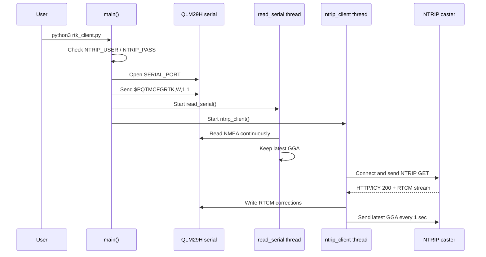
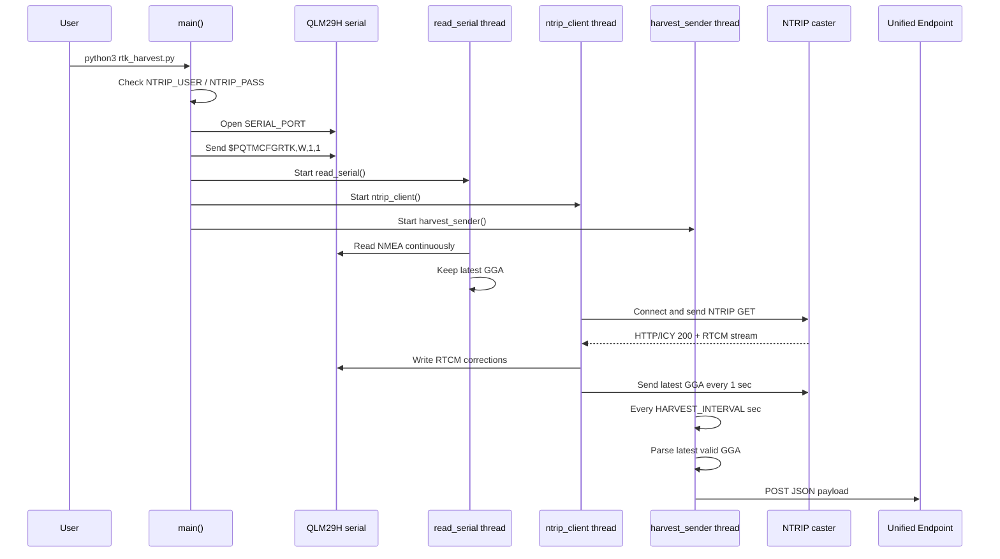
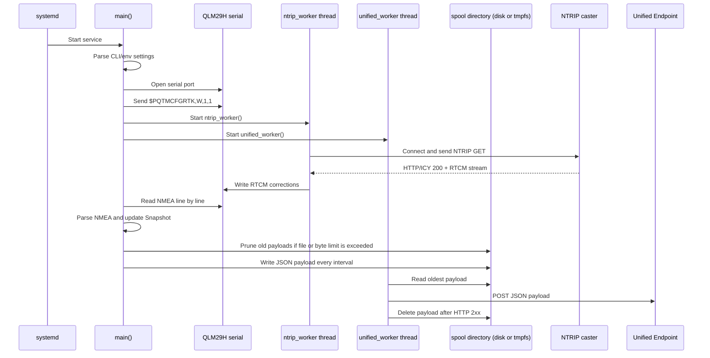

# Python scripts sequence

このドキュメントは、`rtk_client.py`、`rtk_harvest.py`、`rtk_nmea_unified.py` の実行シーケンスを説明します。
3つとも QLM29H から出力される NMEA を読み取り、NTRIP caster から受信した RTCM 補正データを QLM29H へ書き戻す構成です。

## rtk_client.py

`rtk_client.py` は RTK 動作確認用の最小サンプルです。SORACOM/Unified Endpoint へのデータ送信は行いません。

### 起動シーケンス



### Runtime behavior

- `main()` はシリアルポートを開き、`PQTMCFGRTK,W,1,1` でRTKを有効化します。
- `read_serial()` は QLM29H のNMEAを読み続け、最新の `GGA` センテンスだけを共有変数 `latest_gga` に保存します。
- `ntrip_client()` はNTRIP casterへ接続し、RTCM補正データを受信して同じシリアルポートへ書き込みます。
- NTRIP casterには1秒ごとに最新の `GGA` を返します。casterはこの位置情報を使って補正データを配信します。
- NTRIP接続が切れた場合は5秒待って再接続します。

## rtk_harvest.py

`rtk_harvest.py` は `rtk_client.py` の流れに加えて、最新の有効な `GGA` を JSON に変換し、SORACOM Unified Endpointへ定期送信します。

### 起動シーケンス



### Runtime behavior

- `read_serial()` と `ntrip_client()` の役割は `rtk_client.py` と同じです。
- `ntrip_client()` がNTRIP接続に成功すると `ntrip_connected = True` になります。
- `harvest_sender()` は `HARVEST_INTERVAL` 秒ごとに動きます。
- NTRIP未接続、GGA未取得、または `quality=0` のNo Fixの場合は送信しません。
- `parse_gga()` は `GGA` から緯度、経度、fix quality、衛星数、HDOP、高度、UTC時刻を取り出します。
- `requests.post()` で `http://unified.soracom.io` へ JSON を送ります。
- Unified Endpointへの送信失敗はログ出力のみで、NTRIP処理自体は継続します。

### Harvest payload

`rtk_harvest.py` が送信するJSONは、最新の有効な `GGA` から作られます。

```json
{
  "lat": 35.75502113,
  "lon": 139.66172053,
  "quality": 4,
  "quality_label": "Fixed RTK",
  "satellites": 39,
  "hdop": 0.47,
  "alt": 40.48,
  "utc_time": "02:16:45Z"
}
```

## rtk_nmea_unified.py

`rtk_nmea_unified.py` は長時間稼働と systemd デーモン化を前提にしたサンプルです。
`rtk_harvest.py` より多くのNMEAセンテンスを構造化し、Unified Endpoint送信はspoolを経由します。
spool先はSDカード上のディレクトリまたはRAM上のtmpfsを選択できます。

### 起動シーケンス



### Runtime behavior

- `main()` は環境変数またはCLI引数からシリアルポート、Unified Endpoint、NTRIP設定を読みます。
- systemdで使う場合は `SERIAL_PORT=/dev/serial/by-id/...` のような安定したデバイス名を指定します。
- SDカードへの書き込みを避ける場合は、`UNIFIED_SPOOL_STORAGE=ram` または `UNIFIED_SPOOL_DIR=/run/...` でRAM上のtmpfsをspool先にします。
- 起動直後に `PQTMCFGRTK,W,1,1` を送り、RTK/RTD auto modeを有効化します。
- `ntrip_worker()` はNTRIP casterへ接続し、最新の `GGA` を1秒ごとに返しながらRTCMをシリアルへ書き込みます。
- メインスレッドはシリアルからNMEAを読み続け、`GGA/RMC/GLL/VTG/GSA/GSV` などを構造化して `Snapshot` に蓄積します。
- 送信間隔ごとに `Snapshot.build_payload()` でJSONを作り、spoolディレクトリに原子的に保存します。
- `unified_worker()` はspool内の古いJSONから順にUnified EndpointへPOSTします。
- HTTP失敗やLTE一時断が起きた場合、送信できなかったpayloadはspoolに残り、次回以降に再送されます。
- `UNIFIED_MAX_SPOOL_FILES` がリングバッファの最大件数で、上限に達すると古いpayloadから削除します。
- `UNIFIED_MAX_SPOOL_BYTES` を指定すると、spool内JSON payloadの合計byte数でも上限管理できます。
- spool書き込み前に古いpayloadを削除して空きを作ります。書き込み失敗時は古いpayloadを1件追加削除して一度だけ再試行し、それでも失敗した送信窓はdropします。
- RAM上のspoolは再起動で消えますが、SDカードへの書き込みを避けられます。
- シリアル読み取りとHTTP POSTは別スレッドなので、Unified Endpoint側が詰まってもNMEA読み取り窓は止まりません。
- HTTP 2xx以外、タイムアウト、接続エラーはログに出し、`UNIFIED_POST_RETRY_DELAY` 後に再試行します。この待機は新規payload到着では短縮されません。
- NTRIP thread側でRTCMのserial書き込みに失敗した場合はmain threadへfatal serial errorを通知し、プロセスは終了コード1で抜けます。

### Unified payload

`rtk_nmea_unified.py` は単一の最新位置だけではなく、送信窓内のNMEAセンテンスをキー付きJSONとして送信します。

```json
{
  "source": "qlm29h_nmea",
  "serial_port": "/dev/serial/by-id/usb-1a86_USB_Serial-if00-port0",
  "sent_at": "2026-07-11T06:32:12.000000+00:00",
  "window": {
    "started_at": "2026-07-11T06:32:07.000000+00:00",
    "ended_at": "2026-07-11T06:32:12.000000+00:00",
    "duration_sec": 5.0
  },
  "sentence_counts": {
    "GNGGA": 5,
    "GNRMC": 5,
    "GPGSV": 25
  },
  "quality_label": "Fixed RTK",
  "nmea": {
    "GNGGA": {},
    "GNRMC": {},
    "GPGSV": []
  }
}
```

## Difference between the scripts

| Item | `rtk_client.py` | `rtk_harvest.py` | `rtk_nmea_unified.py` |
|---|---|---|---|
| RTK enable command | Yes | Yes | Yes |
| NTRIP connection | Yes | Yes | Yes |
| RTCM forwarding to QLM29H | Yes | Yes | Yes |
| Latest GGA tracking | Yes | Yes | Yes |
| Parsed NMEA scope | GGA status only | GGA position payload | GGA/RMC/GLL/VTG/GSA/GSV and generic sentences |
| Unified Endpoint POST | No | Yes | Yes |
| HTTP send path | Not applicable | Inline sender thread | Disk/RAM spool + sender thread |
| No Fix handling | Logs only | `quality=0` is skipped | All NMEA can be sent, including No Fix windows |
| LTE/HTTP interruption tolerance | Not applicable | Failed payload is dropped | Payload remains in spool and is retried until ring buffer limit |
| Main purpose | RTK/NTRIP behavior check | RTK/NTRIP plus location data upload | Long-running daemon and full NMEA JSON upload |
