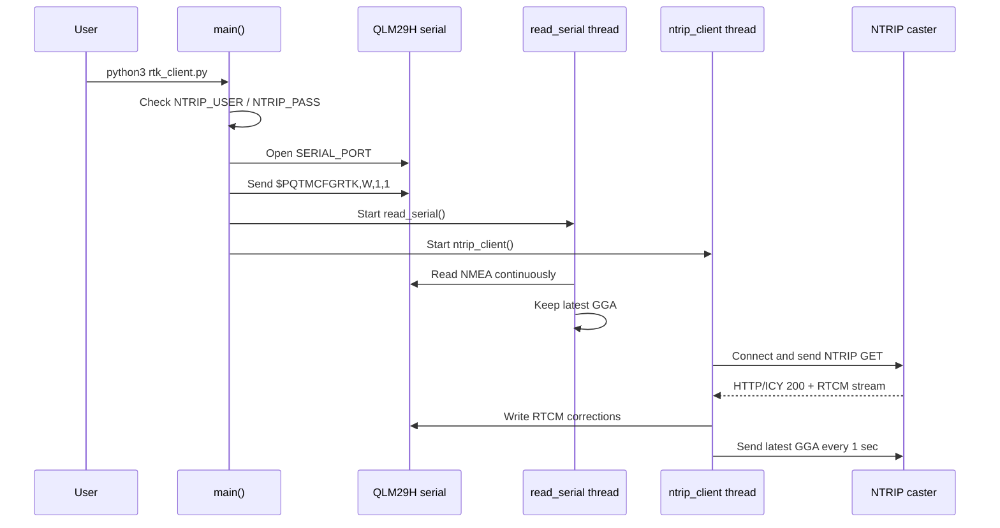
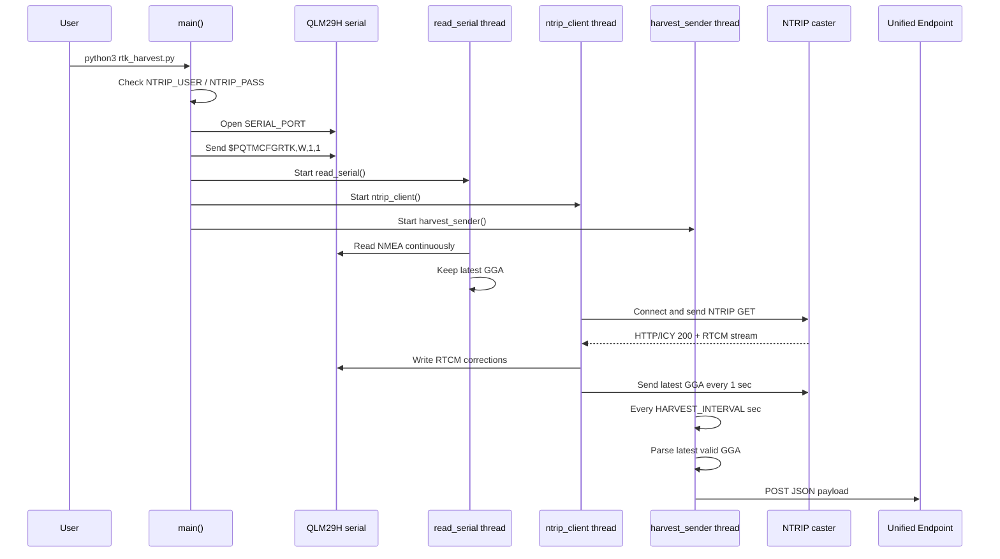

# Python scripts sequence

このドキュメントは、`rtk_client.py` と `rtk_harvest.py` の実行シーケンスを説明します。
どちらも QLM29H から出力される NMEA を読み取り、NTRIP caster から受信した RTCM 補正データを QLM29H へ書き戻す構成です。

## rtk_client.py

`rtk_client.py` は RTK 動作確認用の最小サンプルです。SORACOM/Unified Endpoint へのデータ送信は行いません。

### 起動シーケンス



### Runtime behavior

- `main()` はシリアルポートを開き、`PQTMCFGRTK,W,1,1` でRTKを有効化します。
- `read_serial()` は QLM29H のNMEAを読み続け、最新の `GGA` センテンスだけを共有変数 `latest_gga` に保存します。
- `ntrip_client()` はNTRIP casterへ接続し、RTCM補正データを受信して同じシリアルポートへ書き込みます。
- NTRIP casterには1秒ごとに最新の `GGA` を返します。casterはこの位置情報を使って補正データを配信します。
- NTRIP接続が切れた場合は5秒待って再接続します。

## rtk_harvest.py

`rtk_harvest.py` は `rtk_client.py` の流れに加えて、最新の有効な `GGA` を JSON に変換し、SORACOM Unified Endpointへ定期送信します。

### 起動シーケンス



### Runtime behavior

- `read_serial()` と `ntrip_client()` の役割は `rtk_client.py` と同じです。
- `ntrip_client()` がNTRIP接続に成功すると `ntrip_connected = True` になります。
- `harvest_sender()` は `HARVEST_INTERVAL` 秒ごとに動きます。
- NTRIP未接続、GGA未取得、または `quality=0` のNo Fixの場合は送信しません。
- `parse_gga()` は `GGA` から緯度、経度、fix quality、衛星数、HDOP、高度、UTC時刻を取り出します。
- `requests.post()` で `http://unified.soracom.io` へ JSON を送ります。
- Unified Endpointへの送信失敗はログ出力のみで、NTRIP処理自体は継続します。

### Harvest payload

`rtk_harvest.py` が送信するJSONは、最新の有効な `GGA` から作られます。

```json
{
  "lat": 35.75502113,
  "lon": 139.66172053,
  "quality": 4,
  "quality_label": "Fixed RTK",
  "satellites": 39,
  "hdop": 0.47,
  "alt": 40.48,
  "utc_time": "02:16:45Z"
}
```

## Difference between the two scripts

| Item | `rtk_client.py` | `rtk_harvest.py` |
|---|---|---|
| RTK enable command | Yes | Yes |
| NTRIP connection | Yes | Yes |
| RTCM forwarding to QLM29H | Yes | Yes |
| Latest GGA tracking | Yes | Yes |
| Unified Endpoint POST | No | Yes |
| No Fix filtering | Not applicable | `quality=0` is skipped |
| Main purpose | RTK/NTRIP behavior check | RTK/NTRIP plus location data upload |

## Operational note

For long-running daemon operation, use `rtk_nmea_unified.py` instead of these two sample scripts.
It keeps the same NTRIP and NMEA roles, but adds structured NMEA parsing, disk-backed Unified Endpoint spool, and systemd-friendly execution.
