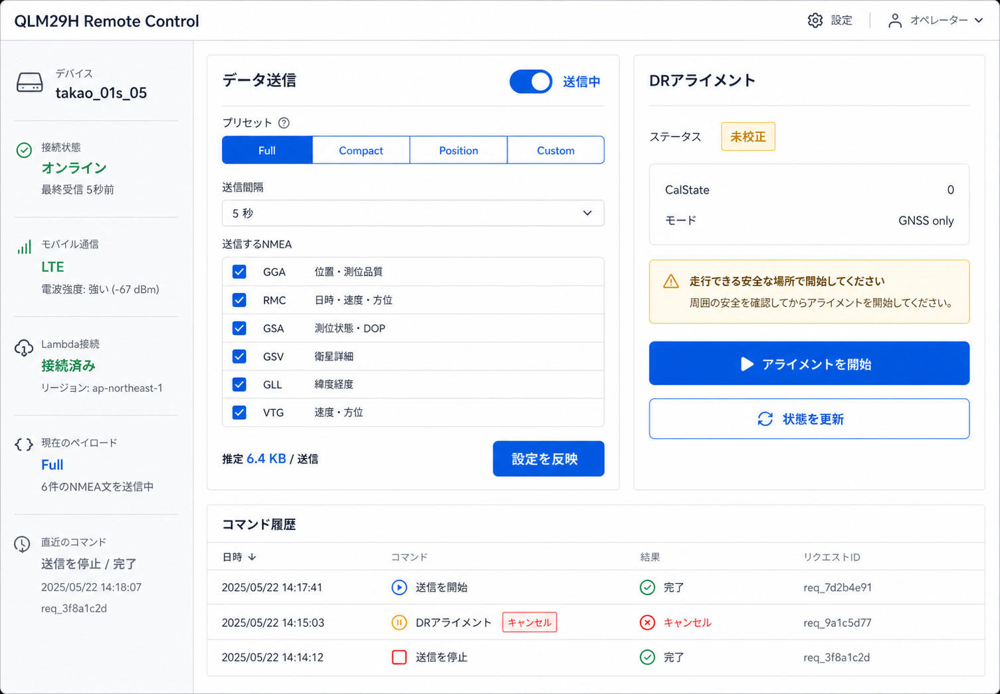
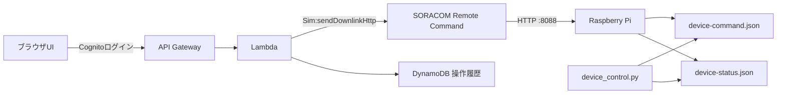

# QLM29H Remote Control UI

QLM29Hの送信設定とDRアライメントをブラウザから操作するLambdaアプリです。デバイスからクラウドへの定期ポーリングは行わず、SORACOM Remote Commandの `Sim:sendDownlinkHttp` APIで必要なときだけHTTPリクエストを送ります。



## 構成



Remote CommandはHTTPレスポンスを10秒以内に返す必要があります。このためデバイスのHTTP受付はコマンドを検証してJSONファイルへ配置した時点で `202 Accepted` を返します。DRアライメントは既存の制御サービスがバックグラウンドで進め、UIは `GET /v1/status` を15秒間隔で確認します。

## 操作できる項目

- データ送信の開始・停止
- Full / Compact / Position / Customプリセット
- 送信間隔
- GGA / RMC / GSA / GSV / GLL / VTGの選択
- DRアライメントの開始・中止
- DR校正状態と直近コマンドの確認

## デバイス側の準備

`remote_command_http.py` は既存の `device_control.py` と同じJSONインターフェースを利用します。

```bash
sudo install -m 0644 qlm29h-remote-command-http.service /etc/systemd/system/
sudo install -m 0600 config/remote-command.env.example \
  /home/pi/.config/qlm29h/remote-command.env
sudoedit /home/pi/.config/qlm29h/remote-command.env
sudo systemctl daemon-reload
sudo systemctl enable --now qlm29h-remote-command-http.service
```

`REMOTE_COMMAND_TOKEN` は十分に長いランダム値へ置き換え、AWS Secrets Managerにも同じ値を登録します。HTTP受付は次の二つを両方確認します。

1. 接続元がSORACOM AirのRemote Command送信元 `100.127.10.16` であること
2. `Authorization: Bearer ...` がデバイスごとの共有トークンと一致すること

ローカルだけで受付を確認するときは、実運用サービスを起動せず次のように接続元を上書きできます。

```bash
REMOTE_COMMAND_TOKEN=local-test-token \
python3 remote_command_http.py --bind 127.0.0.1 --allowed-source 127.0.0.1

curl -H 'Authorization: Bearer local-test-token' \
  http://127.0.0.1:8088/v1/status
```

## SORACOM側の認証

Lambda専用のSORACOM SAMユーザーを作成し、必要なAPIを `Sim:sendDownlinkHttp` に限定します。そのSAMユーザーのAuthKeyとデバイス共有トークンを、AWS Secrets Managerへ次のJSON形式で保存します。

```json
{
  "authKeyId": "keyId-...",
  "authKey": "...",
  "remoteCommandToken": "デバイス側と同じランダム値"
}
```

ルートアカウントのメールアドレスやパスワードはLambdaへ保存しません。

## ビルドとデプロイ

前提はNode.js、pnpm、AWS SAM CLIです。

```bash
cd remote_control_ui
./build.sh
sam build
sam deploy --guided
```

主なデプロイパラメータは以下です。

| パラメータ | 内容 |
|---|---|
| `SoracomSimId` | 対象SIM ID。既定値は `8942310224000601522` |
| `SoracomCoverage` | plan01sなどグローバルカバレッジは `g` |
| `SoracomSecretArn` | 上記Secrets ManagerシークレットのARN |
| `CognitoDomainPrefix` | Cognitoで一意になるログインドメイン接頭辞 |
| `DashboardUrl` | Cognitoが戻る画面URL。末尾 `/` まで完全一致させる |

API Gatewayの自動生成URLを利用する場合は、初回を既定のlocalhostでデプロイし、出力された `DashboardUrl` をパラメータへ指定してもう一度デプロイします。その後、Cognito User Poolへ管理者ユーザーを1名作成してログインします。本番運用では先に独自ドメインを決め、そのURLを最初から指定する方法がわかりやすいです。

## ローカル画面確認

`public/runtime-config.json` はモックモードに設定済みです。AWSや実機を操作せず、すべての画面操作を確認できます。

```bash
cd remote_control_ui/frontend
pnpm install
pnpm dev
```

ブラウザで `http://127.0.0.1:5173/` を開きます。Lambdaから配信するときは `/runtime-config.json` がCognito設定へ自動的に置き換わり、実APIだけを呼びます。

## セキュリティ上の境界

- ブラウザからSORACOM APIキーへ直接アクセスさせない
- 画面の管理APIはAPI Gateway JWT Authorizerで保護する
- CognitoはAuthorization Code + PKCEを利用する
- SORACOM AuthKeyと共有トークンはSecrets Managerだけに保存する
- デバイス側でもアクションをallowlist検証し、任意コマンドやシェル実行を受け付けない
- DRアライメント開始時は確認画面を出し、既存校正の消去は別の明示操作にする

SORACOMの仕様は[Remote Command](https://users.soracom.io/ja-jp/docs/remote-command/)と[HTTP/Sでコマンドを送信する](https://users.soracom.io/ja-jp/docs/remote-command/send-command-via-http/)を参照してください。
